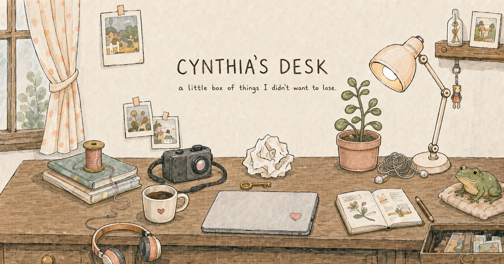

# Cyn's Desk

> A small, hand-drawn personal archive for the things I made, noticed, tried, listened to, read, and wanted to remember.

[Visit the live site](https://cynsdesk.liminfei080602.chatgpt.site)



## About

Cyn's Desk is an illustrated personal room rather than a conventional portfolio. Objects on the desk open into different physical spaces: a wall of Polaroids, a listening wall, a reading pile, a thought wall, a tinkering workbench, and a memory drawer.

The public site is open for anyone to explore. Creating, editing, rearranging, uploading, and deleting entries remain restricted to the owner.

## Rooms in the desk

- **Little things I noticed** — casually taped photographs and observations
- **Things I made** — an imperfect craft table of handmade pieces
- **Favorite drink** — café notes, receipts, cups, stains, and remembered places
- **Things I don't want to forget** — a quiet drawer of photographs and fragments
- **Things I listened to** — records, singles, podcasts, sleeves, and listening notes
- **Pages I kept** — books, articles, lyrics, quotations, and loose passages
- **Things stuck in my head** — crumpled thoughts unfolded and pinned to a wall
- **Things I tried** — an active workbench for ideas, attempts, links, photos, and PDFs
- **The box, over time** — day, week, and month views of the same archive
- **Show me sth** — a drawer that pulls one unexpected thing from the collection

## Highlights

- One shared content system across every room
- Owner-only studios for adding, editing, arranging, and deleting entries
- Image and PDF uploads backed by object storage
- External links for books, articles, music, references, and projects
- Responsive physical compositions rather than uniform mobile cards
- Keyboard-accessible dialogs and reduced-motion support
- Real Hong Kong calendar date and time-aware desk lighting
- Random discovery and frog interactions grounded in saved archive content
- Local, no-API memory reflections based on dates, rooms, repeated words, and nearby entries
- Source links beneath generated connections and weekly/monthly summaries

## No paid AI API required

The reflection system does not call OpenAI or any other paid AI API. It uses deterministic retrieval and local rules to identify supported patterns in the archive. Original photographs, text, dates, links, and notes are never rewritten.

## Technology

- React 19
- TypeScript
- [vinext](https://github.com/cloudflare/vinext)
- Cloudflare Workers-compatible server output
- Cloudflare D1 for structured content
- Cloudflare R2 for uploaded images and PDFs
- Drizzle schema and migrations
- Sites hosting and owner identity headers

## Project structure

```text
app/
  api/          Server routes for content, media, memory, and studio actions
  sessions/     Public illustrated session rooms
  studio/       Owner-only editing surfaces
db/             Database helpers and schema
drizzle/        D1 migrations and migration metadata
lib/            Content store, session registry, timeline, and memory logic
public/         Desk artwork, icons, and social preview image
tests/          Build-level feature checks
worker/         Worker entrypoint
build/          Sites/Vite integration
.openai/        Logical Sites hosting bindings
```

## Run locally

### Requirements

- Node.js 22.13 or newer

### Setup

```bash
npm install
npm run dev
```

Then open the local address printed by the development server.

### Validate

```bash
npm test
```

Or run the production build separately:

```bash
npm run build
```

## Storage and authentication

The logical production bindings are declared in `.openai/hosting.json`:

- `DB` — D1 database
- `MEDIA` — R2 media bucket

The first authenticated owner claims the private editing system. Public visitors can read published entries, but write operations are checked on the server and remain owner-only.

Live D1 records and R2 uploads are not stored in this Git repository. The repository contains the complete application source and versioned public assets; personal live content remains in the site's managed storage.

## Privacy and repository safety

- Environment files are ignored by Git.
- No OpenAI API key is required or stored by the application.
- Dependency folders, local databases, caches, logs, and compiled output are excluded.
- Uploaded personal media remains in managed storage unless it is intentionally placed in `public/`.

## Notes

This is a personal creative project. The illustrated desk artwork and personal content belong to Cynthia Li; no reuse license is granted unless stated separately.
